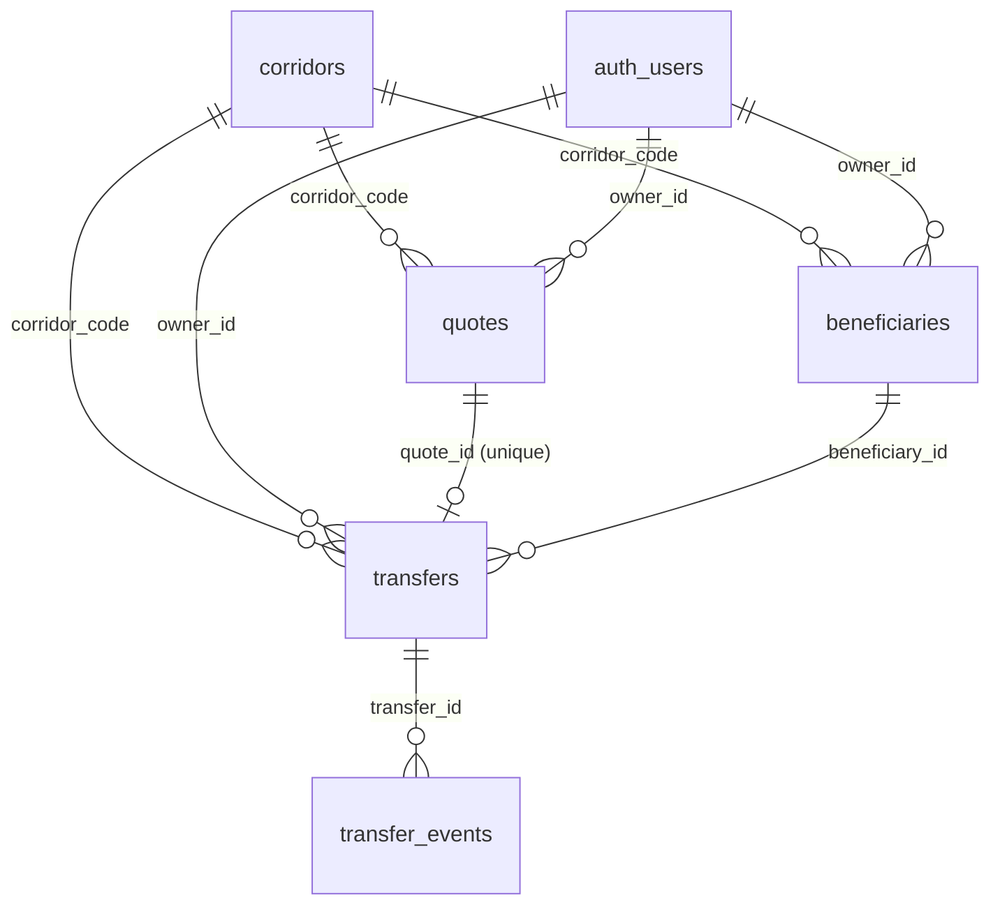
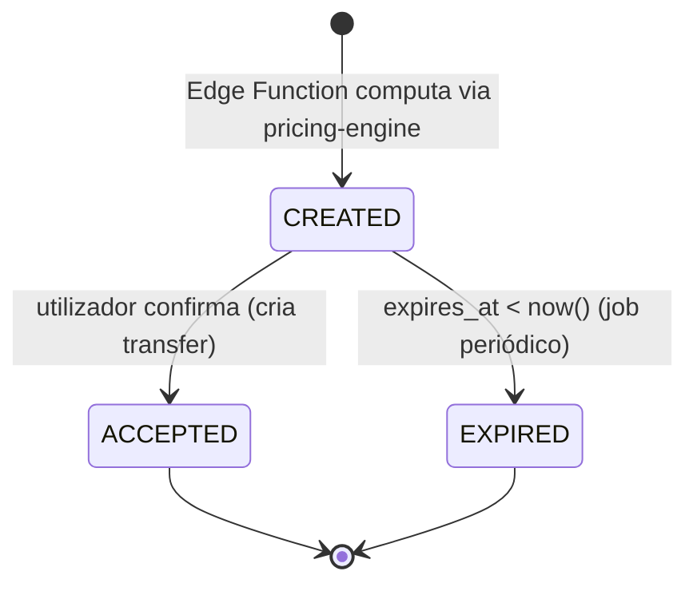
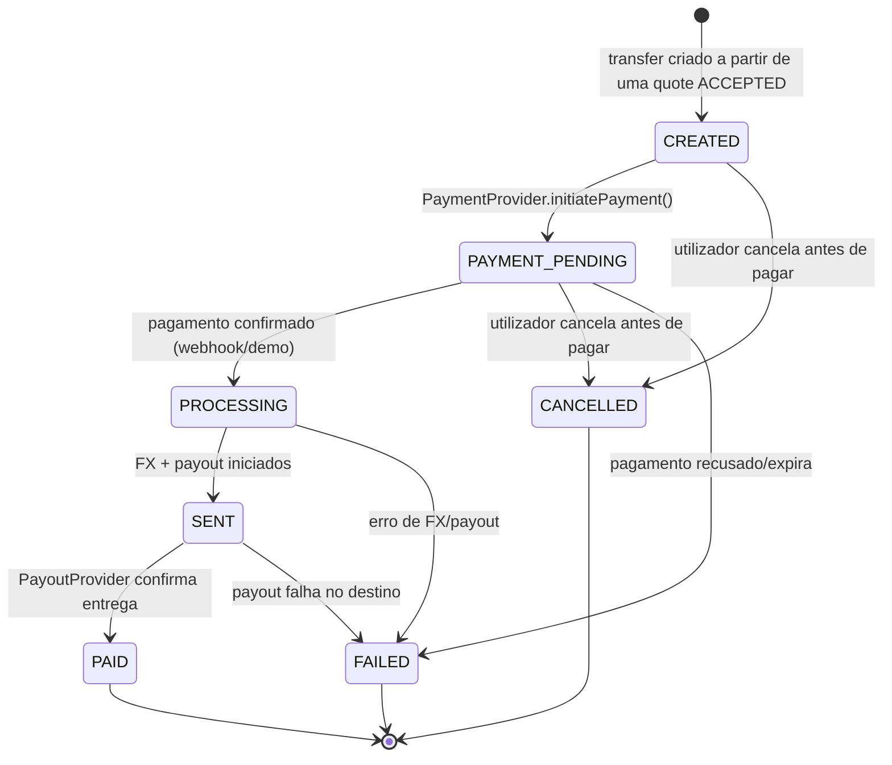
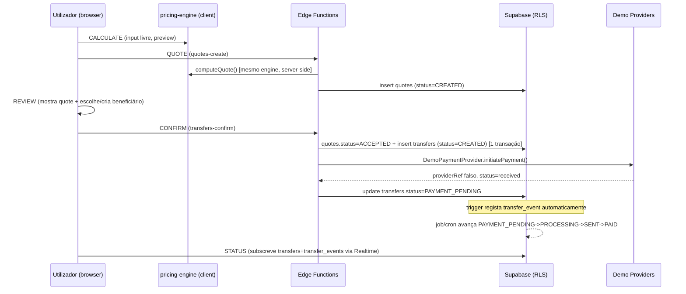

# Kubo Pay — Remittance Core: Especificação Técnica

Documento de referência para a próxima fase do produto: transformar o
simulador atual (client-side, sem persistência) num fluxo de produto real —
`CALCULATE → QUOTE → REVIEW → CONFIRM → TRANSFER → STATUS` — sem movimentar
dinheiro real nesta fase (Demo Mode), mas com uma arquitetura que já suporta
a integração de providers reais mais tarde.

**Estado deste documento: proposta para revisão. Nada foi implementado.**

---

## 0. Ponto de partida e decisão fundacional

A auditoria mostrou que o projeto hoje é: um `index.html` estático + um
Pricing Engine puro (`pricing-engine/`) + Supabase só com a tabela
`waitlist_signups` (INSERT anónimo, sem leitura). Não existe nenhuma camada
server-side própria — todo o acesso a dados é feito diretamente do browser
via chave `anon`, protegido só por RLS.

O Remittance Core introduz, pela primeira vez, escrita **stateful e
sensível a dinheiro** (quotes vinculativas, transfers, beneficiários). Isso
muda o modelo de confiança: já não chega "RLS permite ou nega uma linha",
porque criar uma quote ou avançar um transfer é uma **operação com lógica**,
não um insert simples. Duas decisões fundacionais resultam disto,
assumidas ao longo deste documento:

1. **Camada server-side = Supabase Edge Functions.** Não introduzimos um
   backend novo (Node/Express, etc.). As Edge Functions (Deno) correm com
   `service_role`, conseguem importar diretamente os módulos ES do
   `pricing-engine/` sem build step, e mantêm a stack a 100% dentro do que já
   existe (Supabase + estático). Esta é a opção de menor superfície nova.
2. **Precisamos de alguma identidade de utilizador — decidido: Supabase
   Auth em modo anónimo.** Hoje não existe nenhum conceito de "utilizador"
   — a waitlist é anónima. Mas `beneficiaries`, `transfers` e "ownership
   dos dados" (secção 7 do pedido) não fazem sentido sem uma identidade
   qualquer para o RLS se agarrar. Optámos por **`supabase.auth.signInAnonymously()`**
   em vez de conta com email/magic link, para não introduzir fricção
   nenhuma nesta fase — o utilizador nunca vê um ecrã de login, a app
   chama `signInAnonymously()` na primeira visita e fica com uma sessão.

   Mecanicamente isto não muda nada do resto do documento: um utilizador
   anónimo é uma linha real em `auth.users` (`is_anonymous = true`),
   `auth.uid()` funciona da mesma forma, e todas as policies de RLS da
   secção 7 (`owner_id = auth.uid()`) aplicam-se sem alteração nenhuma —
   só muda **como** essa identidade é criada, não como é usada.

   **Trade-off aceite conscientemente**: a identidade fica presa à sessão/
   dispositivo (cookie/localStorage do browser). Sem email nem password,
   perder isso = perder o acesso ao histórico de transfers e
   beneficiários, sem forma de recuperar. Fica documentado como risco na
   secção 9. O caminho de upgrade (`supabase.auth.updateUser({ email })`
   ou `linkIdentity`, que converte a sessão anónima numa conta real sem
   perder os dados já associados a esse `auth.uid()`) fica preparado mas
   fora de scope para esta fase — só entra quando/se a fricção de perder o
   histórico se tornar um problema real.

---

## 1. Modelo de dados Supabase

### 1.1 Avaliação tabela a tabela

| Tabela | Decisão | Razão |
|---|---|---|
| `corridors` | **Criar** (versão fina) | Precisa de existir como linha na BD para `quotes`/`transfers` terem uma FK real e para haver um `enabled` toggle sem deploy. Mas **não** leva números de pricing — ver 1.3. |
| `pricing_rules` | **Adiar (não criar agora)** | Ver 1.4 — criar isto agora duplicaria a fonte de verdade do pricing, que o pedido explicitamente proíbe. |
| `quotes` | **Criar** | Não existe nada reutilizável — é uma entidade nova. |
| `beneficiaries` | **Criar** | Idem. |
| `transfers` | **Criar** | Idem. |
| `transfer_events` | **Criar** | Idem. |
| `waitlist_signups` | **Não tocar** | Propósito diferente (captação de interesse pré-lançamento, anónima). Não faz sentido reaproveitar para dados transacionais com dono. |

### 1.2 Convenções usadas em todas as tabelas

- PKs `uuid default gen_random_uuid()` — mesmo padrão já usado em
  `waitlist_signups`.
- `created_at timestamptz not null default now()` em todas.
- `updated_at timestamptz not null default now()` nas tabelas mutáveis
  (`corridors`, `beneficiaries`, `transfers`), mantido por um trigger
  genérico partilhado:

  ```sql
  create or replace function public.set_updated_at()
  returns trigger language plpgsql as $$
  begin
    new.updated_at = now();
    return new;
  end;
  $$;
  ```

- Dinheiro em `numeric(18,2)`, taxas de câmbio em `numeric(18,6)` (o CVE/XOF
  já usam 3 casas — 6 dá margem sem forçar `float`).
- Nenhuma tabela usa `on delete cascade` em FKs para dados financeiros —
  apagar um beneficiário ou um transfer nunca deve apagar histórico
  associado. Ver soft-delete em `beneficiaries`.

### 1.3 `corridors`

Registo fino: identidade do corredor + flag operacional. **Os números de
pricing (rate, fee, spread) continuam em `pricing-engine/corridors.js`** —
esta tabela não os duplica.

```sql
create table public.corridors (
  code                  text primary key,               -- 'AO', 'CV', 'GW'
  country               text not null,
  source_currency       text not null,                   -- ISO 4217, ex. 'EUR'
  destination_currency  text not null,                   -- ISO 4217, ex. 'AOA'
  fx_type               text not null check (fx_type in ('fixed','variable')),
  enabled               boolean not null default true,
  created_at            timestamptz not null default now(),
  updated_at            timestamptz not null default now()
);

create trigger corridors_set_updated_at
  before update on public.corridors
  for each row execute function public.set_updated_at();
```

- **PK**: `code` (reaproveita a convenção de string já usada em todo o
  código — `data-code`, `corridorCode`, `CORRIDORS[code]` — em vez de
  inventar um `id` numérico paralelo).
- **Seed inicial**: `AO`, `CV`, `GW`, `enabled = true`, a partir dos valores
  já existentes em `pricing-engine/corridors.js`. `ST`/`MZ` (que já existem
  no `check` da waitlist) só entram aqui quando tiverem pricing real.
- **Índices**: nenhum extra — tabela com 3–5 linhas, PK chega.
- **Risco de duplicação**: `fx_type`/`source_currency`/`destination_currency`
  já existem em `corridors.js`. É duplicação deliberada e pequena (3
  colunas, dados que mudam raramente) para permitir `quotes`/`transfers`
  fazerem `references corridors(code)` — sem isto não há integridade
  referencial nenhuma nessas tabelas. Mitigação: `corridors.js` continua a
  ser a fonte de verdade; um seed script/migration sincroniza a tabela a
  partir do ficheiro, nunca ao contrário.

### 1.4 `pricing_rules` — avaliado, não criado nesta fase

O pedido diz explicitamente: *"O Pricing Engine existente continua a ser a
fonte de verdade. Não duplicar regras de pricing no frontend."* Criar
`pricing_rules` agora como tabela editável violaria o mesmo princípio ao
contrário — passaríamos a ter rate/fee/spread em **dois** sítios (código e
BD) que podem divergir.

Também não há, nesta fase, nenhum motivo funcional para isso: não há feed
de câmbio ao vivo (`marketRate` é input manual), não há admin panel, e cada
`quote` (secção 2) já vai **congelar** os valores resolvidos no momento em
que é criada — o que é, na prática, o registo de auditoria que uma tabela
`pricing_rules` também tentaria dar.

**Fica desenhado para o futuro** (quando existir feed de FX real ou um
admin a editar spreads sem deploy):

```sql
-- FUTURO — não criar agora
create table public.pricing_rules (
  id            uuid primary key default gen_random_uuid(),
  corridor_code text not null references public.corridors(code),
  fx_type       text not null check (fx_type in ('fixed','variable')),
  base_rate     numeric(18,6),              -- null se fx_type = 'variable'
  fee_type      text not null check (fee_type in ('flat','none')),
  fee_value     numeric(18,2) not null default 0,
  spread_type   text not null check (spread_type in ('percentage','none')),
  spread_value  numeric(9,6) not null default 0,
  valid_from    timestamptz not null default now(),
  valid_to      timestamptz,                 -- null = regra ativa
  created_at    timestamptz not null default now()
);
-- + exclusion constraint para não haver duas regras ativas em overlap
-- para o mesmo corridor_code (btree_gist + tsrange).
```

Quando isto for criado, `pricing-engine/engine.js` passa a receber a regra
resolvida como parâmetro (em vez de importar `corridors.js` diretamente) —
o *algoritmo* de pricing não muda, só a fonte dos números de input. Isso é
o que preserva "Pricing Engine continua a ser a fonte de verdade": a
fórmula nunca é reimplementada em SQL nem no frontend.

### 1.5 `quotes`

Snapshot de preço, com lifecycle próprio (secção 2). Os campos mapeiam
1:1 para o objeto `Quote` que `computeQuote()` já devolve — não inventamos
semântica nova, só persistimos o que o Pricing Engine já calcula.

```sql
create table public.quotes (
  id                    uuid primary key default gen_random_uuid(),
  owner_id              uuid not null references auth.users(id),
  corridor_code         text not null references public.corridors(code),
  source_currency       text not null,
  destination_currency  text not null,
  source_amount         numeric(18,2) not null check (source_amount >= 0),
  fee                    numeric(18,2) not null check (fee >= 0),
  market_rate           numeric(18,6) not null check (market_rate >= 0),
  fx_rate               numeric(18,6) not null check (fx_rate >= 0),   -- customerRate
  destination_amount    numeric(18,2) not null check (destination_amount >= 0), -- recipientAmount
  total_cost            numeric(18,2) not null check (total_cost >= 0),
  status                text not null default 'CREATED'
                          check (status in ('CREATED','ACCEPTED','EXPIRED')),
  created_at            timestamptz not null default now(),
  expires_at            timestamptz not null,               -- created_at + TTL (ex. 15 min)
  accepted_at           timestamptz
);

create index quotes_owner_id_idx on public.quotes(owner_id);
create index quotes_status_expires_idx on public.quotes(status, expires_at)
  where status = 'CREATED';   -- índice parcial, só para o job de expiração
```

- **PK**: `id`. **FKs**: `owner_id → auth.users(id)`,
  `corridor_code → corridors(code)`.
- **Constraint adicional a nível de aplicação** (não SQL): `expires_at` só
  pode ser definido pela Edge Function que cria a quote — nunca vindo do
  cliente.
- Campo `market_rate` guardado separadamente de `fx_rate` para a UI poder
  continuar a mostrar "ao câmbio de mercado receberias X" (é exatamente o
  `marketReceivedAmount`/`marketRate` que o simulador já mostra hoje).

### 1.6 `beneficiaries`

```sql
create table public.beneficiaries (
  id              uuid primary key default gen_random_uuid(),
  owner_id        uuid not null references auth.users(id),
  corridor_code   text not null references public.corridors(code),
  full_name       text not null check (length(trim(full_name)) > 0),
  payout_method   text not null,             -- 'mobile_money' | 'bank_account' | ...
  payout_details  jsonb not null,             -- ver formato abaixo
  created_at      timestamptz not null default now(),
  updated_at      timestamptz not null default now(),
  archived_at     timestamptz                 -- soft delete
);

create index beneficiaries_owner_id_idx on public.beneficiaries(owner_id)
  where archived_at is null;

create trigger beneficiaries_set_updated_at
  before update on public.beneficiaries
  for each row execute function public.set_updated_at();
```

- **Soft delete deliberado**: um `transfer` referencia um `beneficiary_id`;
  apagar a linha a sério partiria o histórico de transfers antigos. O
  cliente "apaga" via `UPDATE ... SET archived_at = now()`; RLS não permite
  `DELETE` nenhum (secção 7).
- `payout_details` fica em `jsonb` em vez de colunas fixas porque o formato
  varia por `payout_method`/corredor (nº de telemóvel para Multicaixa
  Express, IBAN para BCA, carteira Wave/Orange). Validação de forma fica na
  Edge Function, não em `CHECK` — um `CHECK` genérico sobre JSON rígido
  fritaria sempre que se adiciona um método novo.

  Exemplo de forma esperada (documentado, não imposto pela BD):
  ```json
  // payout_method = 'mobile_money'
  { "phone": "+244923456789", "network": "multicaixa_express" }
  // payout_method = 'bank_account'
  { "iban": "PT50...", "bank_name": "BCA" }
  ```

### 1.7 `transfers`

```sql
create table public.transfers (
  id                    uuid primary key default gen_random_uuid(),
  quote_id              uuid not null unique references public.quotes(id),
  owner_id              uuid not null references auth.users(id),
  beneficiary_id        uuid not null references public.beneficiaries(id),
  corridor_code         text not null references public.corridors(code),

  -- copiados da quote no momento da criação — ver nota de imutabilidade abaixo
  source_amount         numeric(18,2) not null,
  fee                    numeric(18,2) not null,
  fx_rate               numeric(18,6) not null,
  destination_amount    numeric(18,2) not null,
  total_cost            numeric(18,2) not null,

  status                text not null default 'CREATED'
                          check (status in (
                            'CREATED','PAYMENT_PENDING','PROCESSING',
                            'SENT','PAID','FAILED','CANCELLED'
                          )),
  failure_reason        text,

  -- referências opacas a providers reais — nulas em Demo Mode, ver secção 6
  payment_provider_ref  text,
  fx_provider_ref       text,
  payout_provider_ref   text,

  created_at            timestamptz not null default now(),
  updated_at            timestamptz not null default now(),
  paid_at               timestamptz
);

create index transfers_owner_id_idx on public.transfers(owner_id);
create index transfers_status_idx on public.transfers(status);

create trigger transfers_set_updated_at
  before update on public.transfers
  for each row execute function public.set_updated_at();
```

- **`quote_id unique`**: uma quote só pode gerar **um** transfer — aceitar a
  quote e criar o transfer são, na prática, o mesmo evento.
- **Nota de imutabilidade — porque `transfers` copia campos de `quotes` em
  vez de só ter a FK**: isto parece redundância (o pedido pede para evitar
  tabelas/estruturas redundantes), mas é uma decisão deliberada e comum em
  sistemas financeiros, não um esquecimento. Um `transfer` tem de manter o
  preço que foi cobrado ao cliente *para sempre*, mesmo que a quote
  associada seja recalculada, expire, ou o pricing mude entretanto. Se
  `transfers` só tivesse `quote_id` e lesse o preço via `JOIN`, uma
  alteração futura a `quotes` (ex. uma correção de bug) mudaria
  silenciosamente o valor histórico de transfers já pagos. Copiar os
  campos é o padrão certo aqui — a redundância a evitar é de **tabelas**
  inteiras, não de colunas de dinheiro que precisam de imutabilidade.
- **`corridor_code` também denormalizado** (derivável de `quote_id →
  quotes.corridor_code`): mantido para permitir filtrar/indexar transfers
  por corredor sem `JOIN` (útil para um dashboard operacional). Trade-off
  documentado — remover é seguro se preferires manter `transfers` mais
  magro e sempre fazer `JOIN`.

### 1.8 `transfer_events`

```sql
create table public.transfer_events (
  id            uuid primary key default gen_random_uuid(),
  transfer_id   uuid not null references public.transfers(id),
  event_type    text not null,              -- ver vocabulário abaixo
  from_status   text,                        -- null no evento inicial (CREATED)
  to_status     text not null,
  actor         text not null check (actor in ('user','system','provider_webhook','admin')),
  metadata      jsonb not null default '{}'::jsonb,
  created_at    timestamptz not null default now()
);

create index transfer_events_transfer_id_idx
  on public.transfer_events(transfer_id, created_at);
```

- **Sem `updated_at`, sem `UPDATE`/`DELETE` policy nenhuma** (secção 7) —
  é um log de auditoria, é suposto ser append-only. Uma correção nunca edita
  um evento antigo, insere um novo evento a explicar a correção.
- `event_type` fica como texto livre (documentado, não restrito por
  `CHECK`) porque este log vai eventualmente registar mais do que
  transições de estado (ex. `PROVIDER_WEBHOOK_RECEIVED`,
  `RETRY_ATTEMPTED`) — restringir isso a nível de BD obrigaria a uma
  migration por cada tipo de evento novo. `to_status` sim é limitado ao
  vocabulário de `transfers.status`, porque esse é sempre um valor de
  estado real.
- **Como é preenchida**: não por escrita direta da aplicação, mas por um
  trigger em `transfers` — ver 4.1. Isto garante que é **impossível** um
  transfer mudar de estado sem gerar evento, seja qual for o caminho de
  código que fizer o `UPDATE` (Edge Function hoje, webhook de provider
  amanhã).

### 1.9 Diagrama de relações



---

## 2. Quote — lifecycle



- **CREATED**: resultado de `computeQuote()` persistido, com `expires_at`
  (proposta: `now() + interval '15 minutes'`, configurável).
- **ACCEPTED**: só acontece dentro da mesma transação que cria o `transfer`
  (secção 3) — nunca um `UPDATE quotes SET status='ACCEPTED'` isolado, para
  não haver quotes "aceites" sem transfer correspondente.
- **EXPIRED**: transição automática. Duas opções, com recomendação:
  - (a) **Recomendado**: Supabase Scheduled Edge Function / `pg_cron`
    corre a cada minuto: `update quotes set status='EXPIRED' where
    status='CREATED' and expires_at < now()`. Estado real na BD, consistente
    com o que foi pedido ("lifecycle CREATED → ACCEPTED → EXPIRED").
  - (b) Alternativa mais barata: não transitar fisicamente, calcular
    `is_expired = status='CREATED' and expires_at < now()` em cada leitura.
    Mais simples, mas o pedido descreve `EXPIRED` como um estado do
    lifecycle, não um campo derivado — fico com (a).
- Campos guardados: ver tabela 1.5 — mapeiam diretamente para o `Quote` que
  `pricing-engine/engine.js` já devolve, sem inventar campos novos.

---

## 3. Transfer — lifecycle



- **CREATED → CANCELLED** e **PAYMENT_PENDING → CANCELLED** são as únicas
  transições iniciadas pelo utilizador para um estado terminal (antes de
  haver dinheiro em trânsito). A partir de `PROCESSING`, só o sistema/
  provider pode levar a `FAILED` — o utilizador já não pode "cancelar" uma
  transferência em curso, só o suporte, fora deste fluxo.
- `FAILED` e `CANCELLED` são terminais e mutuamente exclusivos com os
  restantes — nenhuma transição sai deles.
- `failure_reason` só é lido/relevante quando `status='FAILED'`.
- Todas as transições passam pela função descrita em 4.1, nunca por
  `UPDATE` direto vindo de fora dessa função.

---

## 4. Transfer events — auditoria garantida por trigger

### 4.1 Mecanismo

Em vez de confiar em cada Edge Function para "lembrar-se" de escrever o
evento, a garantia fica na base de dados: um trigger em `transfers` regista
automaticamente **qualquer** mudança de `status`, e nesse mesmo trigger
valida que a transição é legal (a máquina de estados da secção 3 aplicada
como código, não só como diagrama):

```sql
create or replace function public.transfers_log_status_change()
returns trigger language plpgsql as $$
declare
  allowed boolean;
begin
  if new.status = old.status then
    return new;  -- update que não muda status: não gera evento
  end if;

  allowed := case old.status
    when 'CREATED'         then new.status in ('PAYMENT_PENDING','CANCELLED')
    when 'PAYMENT_PENDING' then new.status in ('PROCESSING','CANCELLED','FAILED')
    when 'PROCESSING'      then new.status in ('SENT','FAILED')
    when 'SENT'            then new.status in ('PAID','FAILED')
    else false  -- PAID, FAILED, CANCELLED são terminais
  end;

  if not allowed then
    raise exception 'Illegal transfer status transition: % -> %', old.status, new.status;
  end if;

  insert into public.transfer_events (transfer_id, event_type, from_status, to_status, actor, metadata)
  values (new.id, 'STATUS_CHANGE', old.status, new.status,
          coalesce(current_setting('request.jwt.claim.role', true), 'system'),
          '{}'::jsonb);

  if new.status = 'PAID' then
    new.paid_at := now();
  end if;

  return new;
end;
$$;

create trigger transfers_status_change
  before update of status on public.transfers
  for each row execute function public.transfers_log_status_change();
```

- **Efeito**: (1) impossível criar um `transfer_event` "esquecido" — a BD
  garante 1:1 entre mudança de estado e evento; (2) a máquina de estados é
  aplicada mesmo que uma Edge Function futura, ou um webhook de provider,
  tente fazer um `UPDATE` diretamente — uma transição inválida dá `raise
  exception`, não fica só documentada em código que se pode esquecer de
  respeitar.
- O evento `CREATED` inicial (sem `old.status`) é inserido explicitamente
  pela Edge Function que cria o transfer (`from_status = null`), não pelo
  trigger — o trigger só dispara em `UPDATE`.
- `actor` fica derivado de quem está autenticado no momento do `UPDATE`
  (via `service_role` normalmente, já que — ver secção 7 — clientes nunca
  fazem `UPDATE` a `transfers` diretamente).

---

## 5. Pricing — fonte de verdade única

Sem alterações ao contrato de `pricing-engine/engine.js`. A única mudança é
**onde** corre:

- Hoje: `computeQuote()` corre no browser, só para o simulador (não
  vinculativo).
- Remittance Core: `computeQuote()` continua a correr **exatamente na mesma
  forma**, mas dentro da Edge Function `quotes-create` (Deno importa ES
  modules nativamente — `pricing-engine/engine.js` corre lá sem alterações
  nem build step). O resultado é persistido em `quotes`.
- O simulador client-side (`index.html`, CALCULATE) continua a chamar
  `computeQuote()` no browser tal como hoje, só para feedback instantâneo
  enquanto o utilizador experimenta valores — essa chamada **nunca** é
  vinculativa nem gera uma `quote` na BD. Só a chamada à Edge Function cria
  uma `quote` real. Isto evita duplicar a fórmula (que já não seria
  duplicação de código, mas seria duplicação de *confiança* — nunca aceitar
  o preço calculado no cliente como o preço final).

---

## 6. Provider abstraction

Três interfaces, desenhadas para nenhuma delas amarrar o Kubo a um
fornecedor concreto. Convenção JSDoc + `checkJs`, igual ao resto do
`pricing-engine/` — não introduz TypeScript "a sério" no projeto.

```js
/**
 * @typedef {Object} PaymentProvider
 * @property {(transfer: Transfer) => Promise<{providerRef: string, status: 'pending'|'received'|'failed'}>} initiatePayment
 * @property {(providerRef: string) => Promise<{status: 'pending'|'received'|'failed'}>} checkPaymentStatus
 */

/**
 * @typedef {Object} FXProvider
 * @property {(sourceCurrency: string, destCurrency: string, sourceAmount: number) => Promise<{dealRef: string, rate: number}>} lockRate
 * @property {(dealRef: string) => Promise<{status: 'pending'|'executed'|'failed'}>} checkDealStatus
 */

/**
 * @typedef {Object} PayoutProvider
 * @property {(transfer: Transfer, beneficiary: Beneficiary) => Promise<{providerRef: string, status: 'pending'|'sent'|'paid'|'failed'}>} initiatePayout
 * @property {(providerRef: string) => Promise<{status: 'pending'|'sent'|'paid'|'failed'}>} checkPayoutStatus
 */
```

- **Orquestração** (qual Edge Function chama qual provider, em que
  transição) vive fora dos adaptadores — não sabe nem quer saber se está a
  falar com um provider real ou com o Demo Mode.
- **Seleção do adaptador**: variável de ambiente na Edge Function (ex.
  `PROVIDER_MODE=demo|live`), resolvida uma vez no arranque da função —
  troca de provider real nunca implica tocar na máquina de estados
  (secção 3/4) nem no schema (as colunas `*_provider_ref` já existem desde
  o dia 1, ver 1.7).
- Cada provider real (quando existir) implementa a interface e escreve o
  seu `providerRef` na coluna correspondente (`payment_provider_ref`,
  `fx_provider_ref`, `payout_provider_ref`) — usado depois para
  reconciliação/idempotência em webhooks.

---

## 7. Segurança

### 7.1 Regra geral

**Nenhuma escrita que mude dinheiro ou estado passa pelo cliente
diretamente.** O cliente (chave `anon`/utilizador autenticado) só faz
leitura direta e CRUD não-financeiro (`beneficiaries`, exceto `DELETE`).
Tudo o resto passa por Edge Functions com `service_role`, que validam,
chamam `pricing-engine`, e só depois escrevem.

Isto é a mesma filosofia que já existe em `waitlist_signups` (INSERT
anónimo, sem leitura nenhuma) — só que agora há mais tabelas e mais formas
de errar uma policy, por isso a regra fica escrita aqui em vez de confiada
à memória.

### 7.2 RLS por tabela

| Tabela | SELECT | INSERT | UPDATE | DELETE |
|---|---|---|---|---|
| `corridors` | público (`enabled=true`), qualquer role | `service_role` only | `service_role` only | nunca |
| `quotes` | dono (`owner_id = auth.uid()`) | `service_role` only (via Edge Function) | nunca do cliente | nunca |
| `beneficiaries` | dono | dono (`owner_id = auth.uid()`) | dono | **nunca** (soft delete via UPDATE `archived_at`) |
| `transfers` | dono | `service_role` only | nunca do cliente | nunca |
| `transfer_events` | dono, via subquery a `transfers.owner_id` | ninguém (só o trigger, correndo como definer da função) | nunca | nunca |

- **`quotes`/`transfers` sem `UPDATE` para o cliente**: a transição
  `CREATED→ACCEPTED` de uma quote e todas as transições de `transfers`
  passam por Edge Functions (`quotes-accept`, `transfers-confirm`,
  `transfers-cancel`), que fazem a validação de negócio (quote não
  expirada, pertence ao utilizador, beneficiário válido) antes de tocar na
  BD. Um `UPDATE` direto do cliente contornaria essa validação mesmo com
  RLS correta a nível de "linha pertence ao dono".
- **`beneficiaries` sem `DELETE`**: só `archived_at` via `UPDATE`, para não
  partir a FK de `transfers.beneficiary_id` em transfers antigos.
- Policies de exemplo (padrão a replicar):
  ```sql
  alter table public.quotes enable row level security;

  create policy "Owners can read their quotes"
    on public.quotes for select
    to authenticated
    using (owner_id = auth.uid());

  -- SEM policy de insert/update para anon/authenticated:
  -- só service_role escreve (service_role bypassa RLS por definição).
  ```

### 7.3 Ownership

`owner_id`/via-`transfers.owner_id` em todas as tabelas com dados
pessoais. Nada é global exceto `corridors` (dados de catálogo, não
pessoais).

### 7.4 Frontend vs. server-side — resumo

| Operação | Onde |
|---|---|
| CALCULATE (preview de preço, não vinculativo) | Client-side, `pricing-engine/engine.js` direto (como hoje) |
| Criar quote vinculativa | Server-side (Edge Function `quotes-create`) |
| Ler as minhas quotes/transfers/beneficiários | Client-side, `SELECT` direto com RLS |
| Criar/editar/arquivar beneficiário | Client-side, `INSERT`/`UPDATE` direto com RLS |
| Aceitar quote → criar transfer | Server-side (`transfers-confirm`) |
| Avançar estado de um transfer | Server-side (trigger + Edge Function/webhook) |
| Cancelar transfer | Server-side (`transfers-cancel`, valida estado antes) |

### 7.5 Nota sobre o incidente da waitlist

A causa raiz do 401 resolvido nesta sessão foi uma policy criada para o
`cmd` errado (`UPDATE` em vez de `INSERT`) — invisível na dashboard,
demorou várias camadas de diagnóstico a confirmar via `pg_policy` cru.
Com mais tabelas e policies, esse risco multiplica. Recomendo (secção 9,
riscos) um pequeno **teste automatizado de RLS** que corre pedidos reais
contra cada tabela/role e falha se o resultado não bater certo — teria
apanhado aquele bug em segundos em vez de uma sessão inteira.

---

## 8. Demo Mode

### 8.1 Princípio

Demo Mode **não é um caminho de código separado** — é a mesma orquestração
(Edge Functions, máquina de estados, trigger de auditoria) só que com os
três providers da secção 6 trocados por implementações falsas
(`DemoPaymentProvider`, `DemoFXProvider`, `DemoPayoutProvider`), escolhidas
via `PROVIDER_MODE=demo`. Isto significa que tudo o que for testado em Demo
Mode — RLS, máquina de estados, eventos, UI de STATUS — é literalmente o
mesmo código que corre com providers reais no futuro; só a resposta que vem
"de fora" é simulada.

### 8.2 Fluxo simulado



### 8.3 Ritmo do avanço automático

Duas opções, recomendação (b):

- (a) Avançar tudo sincronamente dentro da própria chamada de `CONFIRM`
  (mais simples de implementar, mas finge uma sincronia que os providers
  reais nunca vão ter).
- (b) **Recomendado**: Scheduled Edge Function (cron, ex. a cada 10s) que
  procura transfers em estado não-terminal há mais de N segundos e avança
  um passo, chamando o Demo Provider correspondente. Ensaia desde já o
  padrão assíncrono/orientado a eventos que os providers reais vão exigir
  (webhooks chegam quando calha, não quando o pedido termina) — mais fiel
  à arquitetura final, ainda que um pouco mais de trabalho para montar
  agora.

### 8.4 Isolamento do Demo Mode

Todo o `transfer`/`quote` criado em modo demo grava `metadata.demo = true`
no evento inicial (e proponho, quando houver ambiente de produção a sério,
uma coluna explícita `environment` em vez de depender só de metadata) —
para nunca haver ambiguidade entre um transfer "demo" e um real, mesmo lido
fora de contexto (ex. um export para suporte).

---

## 9. Riscos

| Risco | Impacto | Mitigação proposta |
|---|---|---|
| Sessão anónima presa ao dispositivo/browser — limpar cookies/localStorage, trocar de telemóvel ou desinstalar a app perde o acesso a `beneficiaries`/`transfers` sem forma de recuperar | Utilizador perde histórico (não perde dinheiro real — Demo Mode — mas perde confiança no produto) | Caminho de upgrade para conta com email (`linkIdentity`) já desenhado na secção 0, pronto a ativar assim que a fricção de perder o histórico se tornar um problema real; considerar um aviso na UI a meio do fluxo ("guarda o teu acesso") antes disso |
| RLS mais complexa (5 tabelas novas vs. 1 policy hoje) — já tivemos um incidente de uma policy mal configurada | Repetir o incidente do 401, mas em produção com dinheiro simulado a "desaparecer" | Suite de testes automatizados de RLS (pedidos reais por role/tabela) como parte da implementação, não só verificação manual na dashboard |
| Precisão numérica: `PRICING_SPEC.md` já assinala IEEE-754 `Number` como inadequado para "production ledger" | Baixo agora (Demo Mode, sem dinheiro real), alto quando houver providers reais | Migrar `engine.js` para aritmética inteira (cêntimos) ou `decimal.js` antes de qualquer ligação a dinheiro real — não é urgente para esta fase, mas fica registado para não ser esquecido |
| Job de expiração de quotes / avanço de demo (`pg_cron` ou Scheduled Edge Functions) é infraestrutura nova no projeto | Falha silenciosa de expiração passa despercebida | Alertar/logar quando o job não corre; testar manualmente após o deploy |
| `transfers` denormaliza campos de `quotes` — alguém pode "corrigir" isto para um JOIN no futuro, partindo a imutabilidade | Valores históricos de transfers pagos mudam retroativamente | Comentário explícito no schema/migration a explicar a decisão (já incluído na secção 1.7) |
| Providers reais vão ter comportamento que nenhuma interface antecipa (webhooks fora de ordem, retries, falhas parciais) | Desenho de secção 6 pode precisar de ajustes quando o primeiro provider real entrar | Aceitar como certo — não tentar resolver idempotência/replay agora sem um provider concreto em mãos; a interface fica deliberadamente mínima |
| `index.html` como ficheiro único pode não aguentar bem 6 ecrãs de fluxo (CALCULATE…STATUS) com estado de auth | Manutenção fica difícil, `kubo-simulador-corredores.jsx` órfão continua sem destino | Ver secção 10 — ponto em aberto, não decidido aqui |

---

## 10. Plano de implementação (fases)

1. **Fase 0 — Auth**: ativar Supabase Auth em modo anónimo
   (`signInAnonymously()` na primeira visita, sem ecrã de login).
   Pré-requisito de tudo o resto.
2. **Fase 1 — Schema**: migrations para `corridors` (+ seed),
   `quotes`, `beneficiaries`, `transfers`, `transfer_events`; trigger de
   `updated_at`; trigger de auditoria de `transfers` (secção 4.1); policies
   RLS (secção 7.2).
3. **Fase 2 — Edge Functions**: `quotes-create`, `transfers-confirm`,
   `transfers-cancel`, adaptadores `Demo*Provider`, job de expiração de
   quotes, job/])scheduled function de avanço do Demo Mode.
4. **Fase 3 — Frontend**: ligar CALCULATE (já existe) → `quotes-create` →
   ecrã REVIEW (quote + escolher/criar beneficiário) → `transfers-confirm`
   → ecrã STATUS (Realtime em `transfers`/`transfer_events`). **Ponto em
   aberto, a decidir contigo**: 6 ecrãs com estado de auth e navegação é
   mais do que um único `index.html` aguenta bem — pode ser a altura certa
   de finalmente dar um destino a sério ao `kubo-simulador-corredores.jsx`
   (montar um projeto Vite/React real), em vez de continuar tudo em
   vanilla JS num ficheiro. Não decido isto unilateralmente aqui.
5. **Fase 4 — Observabilidade**: suite de testes de RLS (pgTAP ou scripts
   via REST API, ao estilo do que fizemos manualmente nesta sessão mas
   automatizado), extensão do CI já existente para cobrir as Edge
   Functions (Deno test), uma view/queries SQL para suporte poder ver o
   estado de um transfer sem aceder à dashboard toda.

---

## 11. O que fica deliberadamente fora de scope

- Qualquer integração real de Payment/FX/Payout provider.
- Feed de câmbio ao vivo para `AO` (continua input manual).
- `pricing_rules` como tabela (secção 1.4).
- Painel de admin (para desativar corredores, editar `pricing-engine`,
  ver todas as transfers) — o `corridors.enabled` e as policies já deixam
  espaço para isto, mas construir o painel é trabalho à parte.
- Migração da aritmética de `engine.js` para decimal/inteiros — sinalizado
  como risco (secção 9), não bloqueia Demo Mode.
